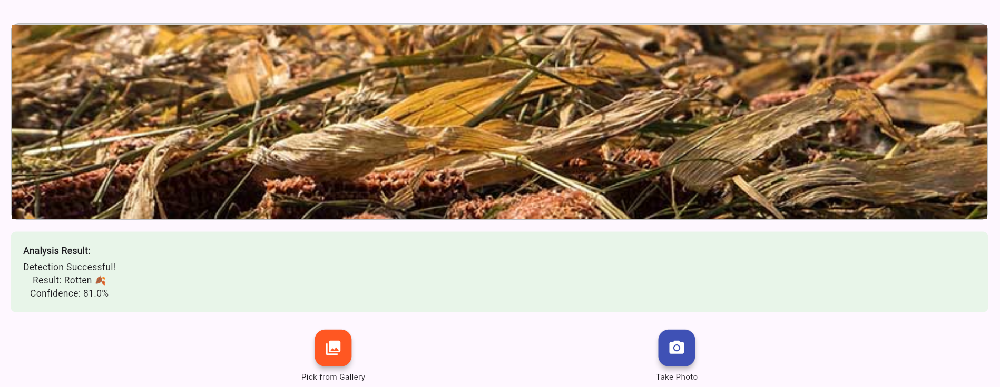

# 🌾 HarvestGuard – Smart Crop Protection & Weather-Aware Farming Assistant

**HarvestGuard** is a smart agriculture assistant built for Bangladeshi farmers to reduce post-harvest food loss and maximize profit using real-time weather data, crop batch tracking, and AI-powered plant health detection.

🔗 **Live App:** [https://harvestguard-bd.netlify.app/](https://harvestguard-bd.netlify.app/)

---

## 📖 Project Overview

HarvestGuard combines modern mobile technology with local agricultural needs. Farmers can track their stored crops, get hyper‑local weather alerts, predict spoilage risks, and scan crop health — all in Bangla & English.

**Goal:** Reduce food loss by up to **40%** and improve farmer income through smart, data-driven decisions.

---

## 🚀 Core Features

### 🔥 Storytelling Landing Page

* Interactive problem-solution onboarding
* Smooth animations and mobile-first UI
* Bangla 🇧🇩 & English 🇬🇧 language toggle
* Narrative Flow: **Problem → Risk → Solution**

---

### 🌱 Farmer & Crop Management

* Secure email & password authentication
* Farmer profile with language preference
* Crop batch creation with:

  * Crop type
  * Estimated weight
  * Harvest date
  * Storage district/division
  * Storage type (Silo / Bag / Open)
* Batch list & detailed batch view
* Gamification badges for motivation

---

### ☁️ Hyper‑Local Weather Forecast

Powered by OpenWeather API:

* 5‑day weather forecast
* Temperature, Humidity & Rainfall probability
* Auto-detected weather by **Upazila**
* Bangla advisories like:

> “আগামী ৩ দিন বৃষ্টির সম্ভাবনা বেশি — ধান ঢেকে রাখুন”

---

### 🔮 Estimated Time to Critical Loss (ETCL)

* Custom spoilage prediction engine
* Uses temperature, humidity & rainfall
* Shows remaining **safe hours** before crop damage
* Bangla alerts for:

  * Mold risk
  * Moisture damage
  * Drying failure

---

### 📷 Basic Crop Health Scanner

Powered by PlantNet API:

* Capture or upload crop photo
* Detect plant species
* Identify healthy or damaged condition

---

### 🗺 Community Risk Awareness Map

* Interactive risk map showing nearby farm spoilage
* Auto-centered on the farmer’s selected district/city
* 10–15 anonymous nearby farm markers (mock data)
* Color-coded risk levels:

  * 🟢 Low Risk
  * 🟡 Medium Risk
  * 🔴 High Risk
* Farmer’s own location with blue pin
* Tap any marker for Bangla pop-ups with crop type, risk, and last update
* Smooth pan & zoom support

---

### 📢 Smart Decision & Alert System

* Generates specific Bangla advice combining:

  * Crop type
  * Weather forecast
  * Current storage risk
* Produces actionable instructions:

> *“আগামীকাল বৃষ্টি হবে এবং আর্দ্রতা বেশি — এখনই গুদামের ফ্যান চালু করুন।”*

* Simulated SMS-style alerts in the console for **Critical Risk** crops

---

### 🐛 AI-Powered Pest Identification & Treatment Plan

* Upload pest or damage images
* Uses Gemini Visual AI + Search Grounding
* Detects pest/disease type & risk (Low/Medium/High)
* Generates hyper-local Bangla treatment plan

> *“পাতায় দাগ → মাঝারি ঝুঁকি → তামা-ভিত্তিক স্প্রে ব্যবহার করুন।”*

* Clean preview of uploaded images

---

### 🎤 Bangla Voice Assistant (Touchless Interaction)

* Natural spoken Bangla commands via Web Speech API (bn-BD)
* Common queries:

  * “আজকের আবহাওয়া কী?”
  * “ধানের ঝুঁকি কত?”
  * “গুদামে কী করব?”
  * “কবে কাটব?”
* Instant spoken replies + text-chat fallback

---

## 🛠 Tech Stack

**Frontend:** Flutter 3.x, Dart, Flutter ScreenUtil
**Backend:** Firebase Authentication, Cloud Firestore, Firebase Storage
**APIs:** OpenWeather API, PlantNet API
**Tools:** Git, GitHub, Netlify

---

## 👥 Team Members

<div align="center">

| Name                           | Role                                         |
| ------------------------------ | -------------------------------------------- |
| Sadrib Shaiyan Islam           | Flutter Developer / UI-UX                    |
| Mohammad Saad Salmee Chowdhury | Flutter Developer / UI-UX                    |
| Pranta Das                     | Backend, Firebase, API Integration & Testing |

</div>

---

## ⚡ Installation & Setup

### 1️⃣ Clone the Repository

```bash
git clone [https://github.com/DasBytes/harvestguard-bd.git](https://github.com/DasBytes/harvestguard-bd.git)
cd harvestguard-bd
````

### 2️⃣ Install Dependencies

```bash
flutter pub get
```

### 3️⃣ Firebase Setup

1.  Create a new Firebase project

2.  Enable:

      * Authentication (Email/Password)
      * Firestore Database
      * Firebase Storage

3.  Download configuration files:

      * `google-services.json` → Android
      * `GoogleService-Info.plist` → iOS

4.  Place them in respective platform folders

### 4️⃣ Environment Variables

Create `.env` in root:

```env
OPENWEATHER_API_KEY=your_api_key_here
PLANTNET_API_KEY=your_api_key_here
```

### 5️⃣ Run the App

```bash
flutter run
```

For Web:

```bash
flutter build web
```

-----

## 🌐 Deployment

### Netlify (Web)

```bash
flutter build web
netlify deploy --prod --dir=build/web
```

-----

## 📱 Screenshots

\<div align="center"\>
\<h3\>Landing & Onboarding\</h3\>
\
\
\

\<h3\>Dashboard & Tracking\</h3\>
\
\
\

\<h3\>Tools & Profile\</h3\>
\
\
\</div\>

-----

## 🌟 Special Notes

  * Supports **Bangla & English**
  * Real-time weather-based crop safety alerts
  * Designed for rural farmers with low-bandwidth support

-----

## 📄 License

For academic and demonstration purposes only.

-----

## 💬 Contact

  * GitHub: [https://github.com/DasBytes](https://github.com/DasBytes)

-----

### 🌾 “Technology that protects every grain.”
